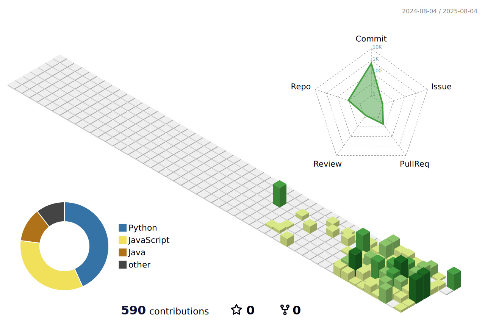

## Hi, I'm Wonjun ! 
```python
class Me:
    def _personal_info(self):
        self.age = 24
        self.job = "student_in_KNU"

    def _skills(self):
        self.tech_stack = ["Python", "AWS", "Django"]
        self.current_interests = ["Engineer Information Security"]

    def _achievements(self):
        self.projects = {
            "Socializer": "PC형 1인칭 텍스트 어드벤쳐 게임 팀프로젝트 UI 디자인",
            "knu-notice": "공주대학교 공지사항 알림 서비스",
            "Tocky": "안드로이드 기반 TOTP (Time-based One-Time Password) 관리자 앱",
	    "grand-trade-auto": "머신러닝 기반 중고차 가격 예측 서비스"}
        self.certifications = ["Engineer Information Processing",
                               "Computer Specialist in Spreadsheet & Database Level-1"]
```


